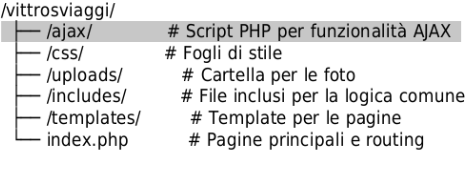

# vittrosviaggi
Vittrosviaggi è un progetto di gestione di un diario di viaggio, sviluppato utilizzando PHP e Bootstrap, che consente la creazione e gestione di articoli, gallerie fotografiche, e slideshow. Il progetto è progettato per essere semplice, estetico e funzionale, con un editor WYSIWYG per facilitare la creazione di contenuti.

## Funzionalità principali
1) Editor per la creazione di post**: Un'interfaccia semplice per scrivere e pubblicare articoli di viaggio.
2) Slideshow fotografico**: Consente di creare slideshow di immagini, con possibilità di inserire audio in sottofondo.
3) Gestione delle foto**: Le foto possono essere caricate e organizzate in un archivio centralizzato.
4) Tema personalizzabile**: Il progetto consente la gestione di temi personalizzati per ciascun articolo.
5) Editor WYSIWYG**: Basato su TinyMCE, permette una modifica visiva dei post, con opzioni per cambiare il font, il colore, lo sfondo e altro.
6) Esportazione PDF**: Permette di esportare i post in formato PDF, con restrizioni per gli utenti non registrati.

## Come iniziare
a) Clonare il repository:
bash
git clone https://github.com/tuo-utente/vittrosviaggi.git

b) Configurare l'ambiente:
Assicurati di avere un server web (come Apache o Nginx) con PHP (versione 8.2 o superiore) e MariaDB configurato per ospitare il progetto.

c) Configurare il database:
Crea un database MySQL/MariaDB con le tabelle necessarie. Puoi trovare lo script di creazione nel file setup.sql.

d) Configurazione del progetto:
Modifica il file di configurazione config.php per adattarlo al tuo ambiente (come il database e la configurazione del tema).

e) Caricare le foto:
Carica le tue foto nella cartella designata (ad esempio, /uploads/).

f) Accesso e gestione:
Accedi al progetto tramite il browser e inizia a creare nuovi post, gallerie fotografiche, e slideshow.
## Struttura del progetto

/vittrosviaggi/
  ├── /ajax/              # Script PHP per funzionalità AJAX
  ├── /css/               # Fogli di stile
  ├── /uploads/           # Cartella per le foto
  ├── /includes/          # File inclusi per la logica comune
  ├── /templates/         # Template per le pagine
  └── index.php           # Pagine principali e routing

## Contribuire
1. Se vuoi contribuire al progetto, sentiti libero di fare un fork e inviare una pull request. Segui le seguenti linee guida:
2. Crea un branch per la tua modifica (git checkout -b feature-nome).
3. Fai le tue modifiche e commit (git commit -am 'Aggiungi nuova funzionalità').
4. Pusha sul tuo branch (git push origin feature-nome).
5. Crea una pull request su GitHub.
## Licenza
Questo progetto è sotto la licenza MIT License.

